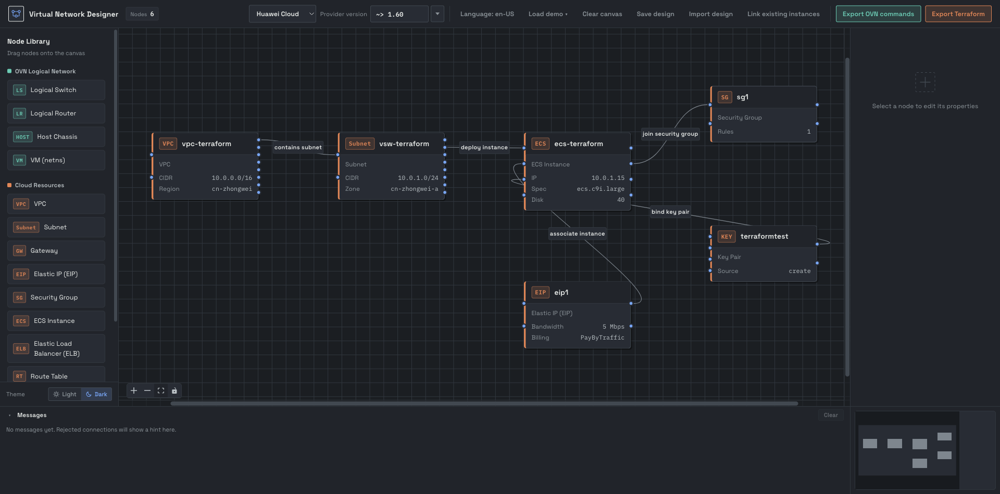
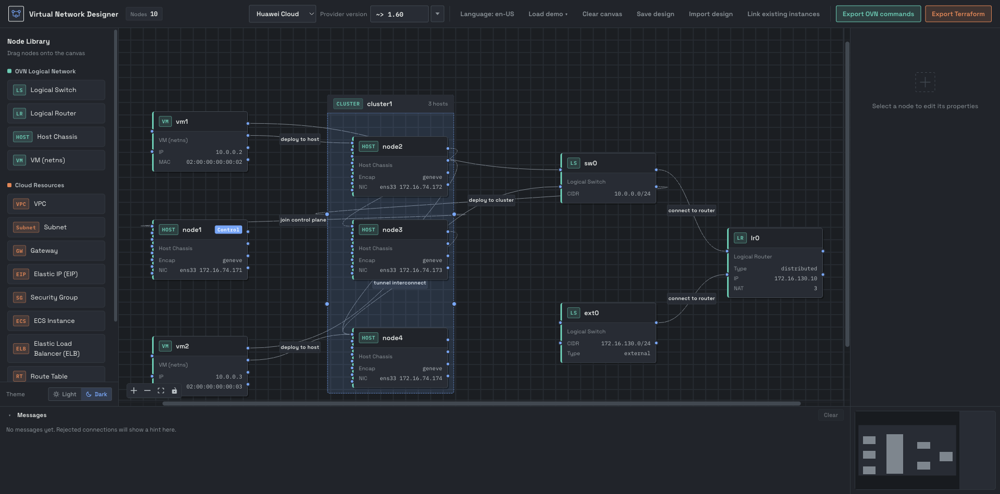

# SDN Designer

English | [中文](./README.md)

A pure-frontend, drag-and-drop virtual network designer. Visually build virtual network topologies by dragging nodes and connecting them, then export **OVN command-line scripts** or **multi-cloud Terraform** definitions (Alibaba Cloud / Tencent Cloud / AWS / Huawei Cloud) in one click.


Built-in demo (cloud resources: VPC + subnet + ECS + security group + EIP + key pair):



## Documentation

- [Usage guide (English)](./doc/usage.en.md) · [中文](./doc/usage.md) — UI, workflows, export and FAQ
- [Project structure (English)](./PROJECT_STRUCTURE.en.md) · [中文](./PROJECT_STRUCTURE.md) — directory layout, data model and conventions
- [Catalog service](./server/README.en.md) — vendor AK/SK proxy and API reference

## Features

- 🖱️ Drag-and-drop canvas: drag nodes from the library, connect them by dragging handles, with zoom, pan and minimap.
- 🔗 Link existing instances: pick a region in the toolbar, fetch live instances and related VPC/subnet/security group/EIP resources, and draw them on the canvas; existing resources export as Terraform data sources.
- 🧭 Built-in demo: the example topology (VPC + subnet + ECS + security group + EIP + key pair) loads automatically on first visit; reload it anytime via "Load demo" in the toolbar.
- 🔀 Connection validation: only legal network relationships are allowed (e.g. VM attached to a logical switch and deployed to a host, VPC containing a subnet).
- 🖥️ OVN logical network: logical switch / logical router / VM (netns) / host (Chassis, with configurable NICs and tunnel encapsulation).
- ☁️ Multi-cloud resources: switch between Alibaba Cloud / Tencent Cloud / AWS / Huawei Cloud, covering VPC / subnet / gateway / EIP / security group / instance / route table / key pair.
- 🔗 Multi-VPC interconnect: drag a "VPC Peering" node and connect multiple VPCs; on export it generates pairwise peerings and auto-fills routes in each VPC's route table.
- 🧩 Instance config: image and instance type as "dropdown + free input" controls (local built-in list merged with online lists, custom values allowed), plus billing method, system / data disks (type, size) and login auth; checking "Deploy GPU instance" switches to GPU types/images and driver install.
- 🔑 Key Pair node: link an instance via `Instance → KeyPair` and choose "Create new key pair" (generated by Terraform with the private key saved) or "Use existing key pair" (references one already in the cloud); once linked, the instance editor hides the inline key pair fields.
- 🧾 Post-creation outputs: check attributes only known after creation (resource ID, public IP, ...) to emit them into `output.tf` on export.
- 🏷️ Provider version: set the current vendor's provider version constraint in the toolbar, either by picking a published version from the dropdown (generates `~> major.minor`) or by typing it manually.
- 🕸️ Tunnel network: hosts interconnect via tunnels to form a "zone"; a logical switch can be deployed to all nodes in a zone.
- 📤 Dual-format export:
  - **OVN**: generates `ovn-nbctl` / `ovs-vsctl` / `ovn-sbctl` command scripts.
  - **Terraform**: generates resource definitions for the selected vendor (resource references, auto-resolved next hops, system / data disks, key pairs created or associated; checked attributes are emitted as an extra `output.tf`) and validates availability zone against region on export.
  - Multiple files can be downloaded as a single ZIP archive; the Terraform export dialog lets you optionally fill in cloud credentials (written to the `variables.tf` defaults; leave blank to use environment variables — generated files contain secrets, do not commit them).
- 🌐 Internationalization: bilingual (Chinese / English), one-click switch in the top-right corner, preference stored locally.

## Getting Started

```bash
npm install     # install dependencies
npm run dev     # dev server at http://localhost:5173/
npm run build   # production build
npm run preview # preview production build
```

## Usage

1. Choose a cloud vendor (Alibaba Cloud / Tencent Cloud / AWS / Huawei Cloud) in the toolbar; cloud node naming and exports follow the selection.
2. Drag nodes from the "Node Library" on the left onto the canvas; the built-in demo loads automatically on first visit, and you can reload it via "Load demo" in the toolbar.
3. Drag a node's right handle onto another node's left handle to connect them (illegal relationships are ignored).
4. Double-click a node (or select it and click "Edit" on the right) to edit its name, CIDR, IP, rules, etc. in a dialog; an instance's image and type can be picked from a dropdown or typed directly.
   - Instances support system / data disks; use "Export Outputs" to check attributes only known after creation (resource ID, public IP, ...).
   - Dragging in a "Host" first opens a creation dialog where you must fill in the node name and NIC info (you can check the tunnel encapsulation NIC).
5. Bind a key pair: connect an instance to a "Key Pair" node and pick "Create new key pair" or "Use existing key pair" in its properties.
6. Link existing instances: click "Link existing instances" in the toolbar, pick a region and fetch, then draw on the canvas (replaces the current design). On Terraform export these nodes become data sources and are not recreated.
7. Click "Export OVN commands" or "Export Terraform" in the toolbar to view and copy / download the result (an extra `output.tf` appears when outputs are checked).

### Building a logical network across physical nodes

1. Drag in multiple "Host" nodes; interconnect the compute hosts (tunnel) to form a cluster, mark one as the control node, then connect the cluster to the control node (join the control plane).
2. Drag in a "Logical Switch" and connect it to any host in the zone (deploy to node).
3. Drag in "VM" nodes, connect them to the logical switch (attach port), then to a host (deploy as a netns on that node).
4. Export the OVN commands; the script generates tunnel encapsulation config, sets `requested-chassis` for each VM, and creates the netns / veth on the target host.

The screenshot below shows a cross-physical-node OVN topology: `node1` is the control node while `node2/3/4` are compute nodes (tunnel-interconnected and auto-merged into a cluster); each node has two NICs, `ens33` (tunnel network) and `ens34` (external network); two VMs are deployed as netns on `node2` and `node4` respectively and attached to the logical switch `sw0`; the logical router `lr0` reaches `172.16.130.0/24` through the external switch `ext0`, with gateway-chassis HA (`node2` primary / `node4` standby) and NAT, providing bidirectional access to `172.16.130.133`.



## Supported Nodes

| Category | Node | Description |
| -------- | ---- | ----------- |
| OVN | Logical Switch | Layer-2 broadcast domain with a subnet CIDR |
| OVN | Logical Router | Layer-3 forwarding, can be marked external |
| OVN | Host Chassis | Physical node with multiple NICs + tunnel encapsulation |
| OVN | VM (netns) | Logical port plus a network namespace on the host, with IP / MAC |
| Cloud | VPC | VPC CIDR block |
| Cloud | VSwitch | Subnet within a VPC + availability zone |
| Cloud | Gateway | NAT gateway |
| Cloud | Elastic IP | Standalone EIP, can be associated with an instance |
| Cloud | Security Group | Ingress / egress rules |
| Cloud | ECS Instance | Image, instance type, billing method, login auth, private IP |
| Cloud | Route Table | Route entries and next hops |
| Cloud | VPC Peering | Connect multiple VPCs, exported as VPC peering |
| Cloud | Key Pair | Login key pair bound to an instance (create / use existing) |

## Instance Image & Type Catalog

An instance's image and instance type are based on a local built-in list, optionally merged with online lists (merged by `value`, online wins on duplicates):

- Local built-in: `src/data/images.js`, `src/data/instanceTypes.js`.
- Online lists are injected via build-time environment variables, see [`.env.example`](./.env.example):
  - `VITE_CATALOG_URL`: remote JSON with the shape `{ "images": { "<vendor>": [{ "value", "label" }] }, "instanceTypes": { ... } }`; partial vendors are allowed.
  - `VITE_CATALOG_API_URL`: a vendor API proxy, see "Configuring the Vendor API Proxy" below.
- If the online fetch fails, it falls back to the local list automatically and works offline.

### Configuring the Vendor API Proxy

Calling vendor APIs directly from the browser requires AK/SK signing and CORS handling, so a backend proxy that calls the vendor APIs and returns normalized results is recommended.

A Go + Gin proxy is bundled in this repo, see [`server/`](./server/README.en.md): fill in **read-only** AK/SK in `server/config.yaml` (or use `mock: true` to run without credentials), start it, and point the frontend at it. For Tencent Cloud it also returns per-zone stock in `zones` for instance types.

1. Copy [`.env.example`](./.env.example) to `.env` and set `VITE_CATALOG_API_URL` (variables prefixed with `VITE_` are injected at build time).
2. The proxy URL supports two modes (see `loadFromApi` in `src/store/catalog.js`):
    - **Per-request**: if the URL contains `{vendor}` / `{kind}` placeholders, it requests each of the 4 vendors (`aliyun` / `tencent` / `aws` / `huawei`) × 2 kinds (`images` / `instanceTypes`) separately (GPU subsets: `gpuImages` / `gpuInstanceTypes`). Include `{region}` to fetch instance types for the VPC region (types unavailable or out of stock there are omitted from the dropdown), e.g.:
      ```bash
      VITE_CATALOG_API_URL=https://catalog.example.com/api/{kind}/{vendor}/{region}
      ```
   - **Full catalog**: if the URL has no placeholders, it expects a single response with the shape `{ "images": { "<vendor>": [...] }, "instanceTypes": { ... } }`.
3. Each catalog item can be a string, or `{ value, label }` (also accepts `{ id, name }`); the response can be a plain array or wrapped in `{ "items": [...] }` / `{ "values": [...] }`. GPU items may include `gpu` / `gpuSpec` / `gpuCount` / `gpuMemoryGiB`.

## Provider Version

The toolbar's "Provider version" field is written as the main provider's `version` constraint in `provider.tf` (e.g. `~> 5.0`, `>= 1.200.0`) and is stored per cloud vendor.

- You can type any Terraform version constraint, or click the arrow to the right of the input to pick from a **published-version dropdown**: the list always shows every version and supports search; picking one generates a `~> major.minor` constraint (e.g. `1.98.2` → `~> 1.98`).
- The candidates come from the build-time variable `VITE_PROVIDER_VERSIONS_URL` (see [`.env.example`](./.env.example)); it supports a `{vendor}` placeholder for per-vendor requests, or a single response covering all vendors. When unset or failing, manual input is the only option.
- The data is served by [`server/`](./server/README.en.md) at `GET /api/providerVersions[/:vendor]`, which pulls from the Terraform Registry (cached) and can be pointed at a private registry.

## Project Structure

See [`PROJECT_STRUCTURE.en.md`](./PROJECT_STRUCTURE.en.md) for the detailed directory structure and data model.

```
src/
├── App.vue        # main orchestration
├── store/         # designer state / vendor / catalog (local + online)
├── data/          # node definitions, vendors, regions, billing, disks, outputs, demo, images, types
├── nodes/         # node components
├── components/    # sidebars / toolbar / inspector / dialogs
├── export/        # OVN export + per-vendor Terraform export (pure functions)
└── i18n/          # locale messages

server/           # Go + Gin online catalog service (vendor AK/SK proxy, separate module)
```

## License

[WTFPL](http://www.wtfpl.net/) — Do What The Fuck You Want To Public License
