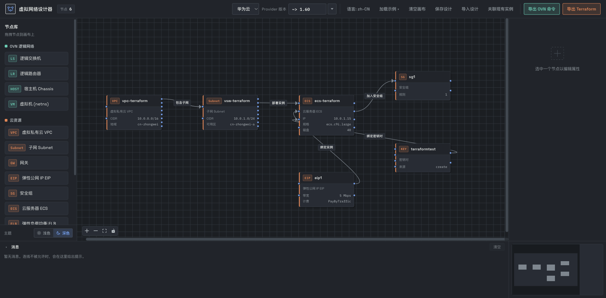
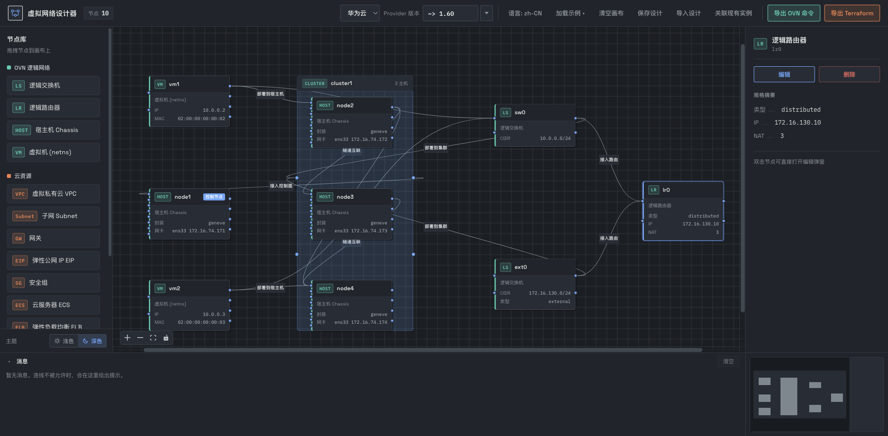

# OVN-Designer 使用指南

[English](./usage.en.md) | 中文

> 本指南面向使用者，介绍界面、操作与典型场景的搭建步骤。开发约定与数据模型见 [`../PROJECT_STRUCTURE.md`](../PROJECT_STRUCTURE.md)。

OVN-Designer 是一个纯前端、拖拽式的虚拟网络设计器：在画布上拖拽节点、连线，完成拓扑设计后一键导出 **OVN 命令脚本** 或 **多云 Terraform 资源定义**（阿里云 / 腾讯云 / AWS / 华为云）。整个设计保存在浏览器本地，无需后端即可使用。

- 内置示例（云资源：VPC + 子网 + ECS + 安全组 + EIP + 密钥对）：

  

- 跨物理节点 OVN 拓扑示例：

  

---

## 目录

1. [快速开始](#快速开始)
2. [界面速览](#界面速览)
3. [画布基础操作](#画布基础操作)
4. [节点参考](#节点参考)
5. [典型场景搭建步骤](#典型场景搭建步骤)
6. [导出](#导出)
7. [在线清单与云厂商代理（可选）](#在线清单与云厂商代理可选)
8. [校验提示与常见问题](#校验提示与常见问题)

---

## 快速开始

```bash
npm install     # 安装依赖
npm run dev     # 开发服务器 http://localhost:5173/
npm run build   # 生产构建
npm run preview # 预览生产构建
```

打开页面后：

- 首次访问会自动载入内置示例（`基础示例`）。工具栏「加载示例」下拉可切换示例（`基础示例` / `负载均衡示例`），画布非空时会先确认覆盖。
- 设计会**自动保存**到浏览器 localStorage，刷新后仍在；工具栏「保存设计」/「导入设计」用 JSON 文件做显式备份与迁移。

---

## 界面速览

```
┌──────────────────────── 顶部工具栏 ────────────────────────┐
│ 厂商 · Provider 版本 · 语言 · 加载示例 · 清空 · 保存/导入 · 关联现有实例 · 导出 │
├──────────┬───────────────────────────────────┬───────────┤
│ 节点库    │            画布 (Vue Flow)         │ 属性面板   │
│ (拖拽)    │  缩放控制 / 网格 / 滚动条           │ (只读摘要) │
├──────────┴───────────────────────────────────┤           │
│ 消息面板                        │ 小地图        │           │
└─────────────────────────────────┴─────────────┴───────────┘
```

- **顶部工具栏**：切换云厂商、设置 Provider 版本、切换语言、加载示例、清空画布、保存/导入设计、关联现有实例、导出 OVN / Terraform。
- **节点库（左侧）**：分「OVN 逻辑网络」与「云资源」两组，拖拽到画布即可创建；底部可切换**浅色 / 深色主题**。
- **画布（中间）**：拖拽节点、连线；左下角有缩放/适配视图/锁定控件；网格为 16px 吸附；右下角小地图可平移缩放。
- **属性面板（右侧）**：选中节点后显示只读「规格摘要」，并提供「编辑」「删除」按钮。
- **消息面板（底部）**：连线被拒绝、重复连线等提示会记录在此，可清空。

---

## 画布基础操作

### 拖入与删除节点

- 从左侧节点库**拖拽**节点到画布。
- 拖入「宿主机 Chassis」时会先弹出创建对话框，需填写节点名称与网卡信息（至少一张网卡；隧道网卡必须填 IP）。
- 删除节点：选中节点后点击右侧属性面板的「删除」按钮。删除集群（Cluster）分组节点会解散分组并还原内部宿主机位置。

### 连线

- 一般在**源节点右侧连接点**按住拖到**目标节点左侧连接点**（画布为 Loose 模式，两端均可发起）；只有合法的关系才允许建立。
- 连线方向有意义：例如 `Subnet → Instance` 表示部署实例，`Instance → SecurityGroup` 表示加入安全组。
- 非法或重复连线不会创建，并在底部消息面板给出原因与建议（如「方向反了，应为 …」）。
- **点击连线即可删除**，悬停时连线高亮为警示色作为反馈；Host↔Host 隧道连线删除后会自动重算集群分组。

### 编辑节点

- **双击节点**，或选中后点击属性面板的「编辑」按钮，打开编辑弹窗。
- 编辑弹窗按节点类型显示不同分区（网卡、安全组规则、路由条目、系统/数据盘、GPU、NAT、网关 Chassis、负载均衡规则、EIP 绑定、导出输出等）。

### 视图操作

- 滚轮缩放、拖拽空白平移；左下角控件可放大/缩小/适配视图/锁定交互。
- 网格按 16px 吸附；底部横向/纵向滚动条与视口联动。
- 右下角小地图可拖拽平移、滚轮缩放。

---

## 节点参考

### OVN 逻辑网络

| 节点 | 作用 | 关键属性 |
| ---- | ---- | ---- |
| 逻辑交换机 (LS) | 二层广播域 | `子网 CIDR`；可勾选「外部网络 (localnet)」（外部交换机需设置 `network_name` 与 `unknown`） |
| 逻辑路由器 (LR) | 三层转发 | 可设「外部网络」，配置外部口 IP/MAC、分布式网关、网关 Chassis（HA）、NAT 规则 |
| 宿主机 Chassis (HOST) | 物理节点 | 隧道协议（Geneve/VXLAN/STT）、多网卡（隧道封装 / 外部网络 / 管理）、是否「控制节点」 |
| 虚拟机 (VM, netns) | 逻辑端口 + 宿主机网络命名空间 | IP、MAC |
| 宿主机集群 (CLUSTER) | 自动分组 | 由互相隧道互联的计算宿主机自动归并，不进节点库 |

**连接规则（OVN 部分）**：

| 源 → 目标 | 含义 |
| ---- | ---- |
| VM → 逻辑交换机 | 挂载端口 |
| VM → 宿主机 | 将该 VM（netns）部署到该宿主机 |
| 逻辑交换机 → 逻辑路由器 | 接入路由 |
| 逻辑路由器 → 逻辑交换机 | 接入交换 |
| 宿主机 → 宿主机 | 隧道互联（计算节点之间会自动归并为集群） |
| 逻辑交换机 → 宿主机 | 部署到节点 |
| 逻辑交换机 → 集群 | 部署到集群内全部计算节点 |
| 集群 → 宿主机（控制节点） | 接入控制面（箭头指向控制节点） |

> 勾选「控制节点」的宿主机不参与计算集群；其他计算宿主机通过隧道互联自动形成「区域（zone）」并归并为一个集群分组节点。

### 云资源

| 节点 | 作用 | 关键属性 |
| ---- | ---- | ---- |
| VPC | 专有网络 | 网段 CIDR、地域（按厂商） |
| 子网 Subnet / VSwitch | VPC 内子网 | CIDR、可用区 |
| 网关 | NAT 网关 | 名称 |
| 弹性公网 IP (EIP) | 独立公网 IP | 数量、带宽、公网计费方式；可绑定实例/网关 |
| 安全组 | 入/出方向规则 | 名称；规则在编辑弹窗中维护 |
| 实例 (ECS/CVM/EC2) | 计算实例 | 镜像、规格、数量、计费方式、私网 IP、登录方式、系统盘/数据盘、GPU |
| 负载均衡 | 监听 + 后端 | 类型（部分厂商）、监听规则、后端实例（穿梭框）、健康检查 |
| 路由表 | 路由条目 | 目的网段、下一跳 |
| VPC 对等连接 | 连接多个 VPC | 名称（导出时按两两全互联生成） |
| 密钥对 | 登录密钥 | 来源（新建 / 关联现有） |

**连接规则（云资源部分）**：

| 源 → 目标 | 含义 |
| ---- | ---- |
| VPC → 子网 | 包含子网 |
| 子网 → 实例 | 部署实例 |
| 实例 → 安全组 | 加入安全组 |
| 密钥对 → 实例 | 绑定密钥对 |
| EIP → 实例 | 绑定实例 |
| EIP → 网关 | 绑定网关 |
| 子网 → 网关 | 部署网关 |
| 实例 → 网关 | 按实例出网 |
| VPC → 网关 | 整网接入网关 |
| 实例 → 负载均衡 | 加入负载均衡 |
| 子网 → 负载均衡 | 子网接入负载均衡 |
| VPC → 负载均衡 | 整网接入负载均衡 |
| 子网 → 路由表 / VPC → 路由表 | 关联路由表 |
| VPC → VPC 对等连接 | 接入对等连接 |

---

## 典型场景搭建步骤

### 1. 跨物理节点的 OVN 逻辑网络

目标：一个控制节点 + 若干计算节点，逻辑交换机部署到集群，VM 以 netns 部署到不同宿主机。

1. 拖入多个「宿主机 Chassis」，填写网卡（含隧道封装网卡）。
2. 把**计算宿主机两两连线**（隧道互联），它们会自动归并为一个集群分组；将其中的一个宿主机勾选为「控制节点」。
3. 拖拽「集群 → 控制节点」建立控制面连接（箭头指向控制节点，等效于集群内全部计算节点接入）。
4. 拖入「逻辑交换机」，连到「集群」（部署到集群内全部节点）或直接连到某个宿主机（部署到该节点）。
5. 拖入「虚拟机」，先连到逻辑交换机（挂载端口），再连到目标宿主机（以 netns 部署）。
6. 点击「导出 OVN 命令」：脚本会为区域内宿主机生成隧道封装配置，为 VM 设置 `requested-chassis`，并在目标宿主机上创建 netns / veth。

参考效果见文首的 OVN 拓扑示例图。

### 2. 外部网络 + NAT + 网关高可用

1. 拖入「逻辑交换机」并勾选「外部网络 (localnet)」，设置 `network_name`（默认 `external`）并保持「设置 unknown」。
2. 拖入「逻辑路由器」，勾选「外部网络」，填写外部口 IP/MAC（IP 留空导出时取外部子网网关并自动分配 MAC），可勾选「分布式网关」。
3. 连线：`内部逻辑交换机 → 路由器`（接入路由）、`外部逻辑交换机 → 路由器`（接入路由）。
4. 在路由器编辑弹窗中配置**网关 Chassis**（勾选承载外部出口的宿主机并设置优先级，数值高者优先，如主 20 / 备 10）与 **NAT 规则**（SNAT / DNAT&SNAT）。
5. 宿主机需配置**外部网络网卡**，其 `network_name` 与外部交换机一致，导出时才会生成 `ovn-bridge-mappings`。
6. 网关 Chassis 宿主机还会额外导出一个 `ovn-gateway-ha-<host>.sh` 常驻脚本，轮询外部网卡 link 状态实现物理链路级高可用。

### 3. 基础云资源（VPC → 子网 → ECS → 安全组/EIP/密钥对）

1. 顶部工具栏选择云厂商（默认阿里云）。
2. 拖入「VPC」，设置网段与地域。
3. 拖入「子网」，连线 `VPC → 子网`，设置 CIDR 与可用区。
4. 拖入「实例」，连线 `子网 → 实例`；在编辑弹窗中选择镜像/规格（下拉 + 可手输）、计费方式、登录方式、系统盘/数据盘。数量 >1 会导出为 Terraform `count`。
5. 拖入「安全组」，连线 `实例 → 安全组`，在编辑弹窗中维护出入方向规则。
6. 按需拖入「EIP」，连线 `EIP → 实例` 绑定公网 IP。
7. 密钥对二选一：
   - 拖入「密钥对」并连线 `密钥对 → 实例`，在密钥对属性中选择「新建密钥对」（由 Terraform 生成并保存私钥）或「关联现有密钥对」（引用云上已有密钥）；绑定后实例登录方式固定为密钥登录。
   - 或不连密钥对节点，直接在实例编辑器内填登录密钥对 / 密码（兼容旧设计）。

### 4. 多台 ECS 共享一个 EIP 出口（NAT 网关）

1. 搭好 `VPC → 子网 → 多台 ECS`。
2. 拖入「网关」，按需要连线：`VPC → 网关`（整网）、`子网 → 网关`（按子网）或 `实例 → 网关`（按实例）。
3. 拖入「EIP」，连线 `EIP → 网关` 作为公网出口。
4. 拖入「路由表」，连线 `子网 → 路由表`（或 `VPC → 路由表`），添加目的 `0.0.0.0/0`、下一跳类型 `NatGateway` 的路由。
5. 导出 Terraform 时按厂商生成对应资源；部分厂商不支持按实例/VPC 的 SNAT，会自动降级并在导出弹窗给出提示。

> 注意：ECS 不直连网关/EIP。多台 ECS 共享出口的正确连法是 `Subnet → Instance` + `Subnet → Gateway` + `Eip → Gateway`。

### 5. 负载均衡

1. 拖入「负载均衡」，接入网络：`子网 → 负载均衡` 或 `VPC → 负载均衡`（决定部署位置与可用区）；`internal` 控制内网/公网。
2. 直接把 ECS 连到负载均衡（`实例 → 负载均衡`），或接入子网/VPC 后由候选后端自动包含其中所有 ECS。
3. 在编辑弹窗中配置**监听规则**：协议 + 端口，用穿梭框把候选 ECS 移入「已选后端」；每条规则可配置健康检查（协议、路径、请求方法、间隔、阈值等）。
4. 阿里云/腾讯云还可选择负载均衡类型（CLB/ALB/NLB/GWLB）与高级配置；类型不同，导出的 Terraform 资源与可用监听协议不同。
5. 导出时按厂商生成对应资源，并对未接入网络、未选后端、类型所需可用区数量不足等给出提示。

### 6. 多 VPC 互联

1. 拖入多个「VPC」。
2. 拖入「VPC 对等连接」，把各 VPC 都连到该节点（`VPC → VPC 对等连接`）。
3. 导出时按两两全互联生成对等连接，并为每个接入 VPC 已有的路由表自动补一条指向该对等连接的路由。

### 7. 部署 GPU 实例

在实例编辑器中勾选「部署 GPU 实例」：镜像与规格下拉会切换到 GPU 清单，并显示 GPU 型号/卡数/显存；可选择安装 NVIDIA 驱动及版本（写入实例启动脚本）。未勾选时 GPU 规格/镜像不会出现在下拉中。

### 8. 关联现有云资源

1. 点击工具栏「关联现有实例」，选择当前厂商的一个地域，点击「拉取资源」。
2. 预览将绘制到画布的 VPC/子网/实例/安全组/EIP/NAT/密钥对/路由表/负载均衡及关系，确认后绘制（**会覆盖当前画布**）。
3. 导入的节点带「已有」标记；导出 Terraform 时会生成 `data` 数据源而**不会重新创建**这些资源，新建资源对它们的引用走 data。

---

## 导出

### OVN 命令

- 点击「导出 OVN 命令」，弹窗按**执行位置**分组：`全部`（合并脚本）、`OVN 控制节点`、各计算 `宿主机 <name>`、以及网关高可用的 `网关高可用 <name>`。
- 命令覆盖：逻辑交换机/路由器创建、localnet 外部端口、交换机与路由器连接、NAT 规则、网关 Chassis、隧道封装（`ovn-remote` / `system-id` / `encap`）、外部网桥与 `ovn-bridge-mappings`、VM 的 netns/veth 等。
- 支持复制、下载单文件、以及「打包下载 (ZIP)」导出全部文件。
- 弹窗顶部「检查提示」列出潜在问题（如外部口未配网关 chassis、仅 1 个网关 chassis、外部 `network_name` 无对应网卡、NAT 外部 IP 不在外部子网等）。

### Terraform

- 点击「导出 Terraform」按当前厂商生成资源定义，自动解析资源引用与下一跳；系统盘/数据盘、密钥对、输出等均会体现。
- 多文件结果可一键打包 ZIP；弹窗可**可选**填入云厂商凭证（写入 `variables.tf` 默认值，留空则走环境变量）。
- **生成文件可能包含密钥，请勿提交到版本库。**
- 导出时会校验可用区与地域是否匹配、实例规格在目标可用区是否有货等，并在「检查提示」中展示。

### 创建后可获取属性（output.tf）

云资源节点可勾选「创建后可获取」的属性（资源 ID；EIP/实例另有公网 IP），在编辑弹窗的「导出输出」分区设置。导出时会在结果中追加一个 `output.tf`；无任何勾选则不生成该文件。

### Provider 版本

工具栏「Provider 版本」写入 `provider.tf` 中主 provider 的 `version` 约束（如 `~> 5.0`、`>= 1.200.0`），按厂商分别保存在本地。

- 可直接手输任意约束，也可点击输入框右侧箭头从**已发布版本下拉**选择（支持搜索，选中后自动生成 `~> 主.次`，如 `1.98.2` → `~> 1.98`）。
- 已发布版本来自环境变量 `VITE_PROVIDER_VERSIONS_URL`（缺省或拉取失败时仅可手输），默认由内置 Go 服务从 Terraform Registry 拉取。

---

## 在线清单与云厂商代理（可选）

实例的「镜像」与「实例规格」以本地内置清单为基底，可选叠加在线清单。浏览器直连云厂商 API 需要处理 AK/SK 签名与 CORS，建议由后端代理。本仓库内置了 Go + Gin 代理（见 [`../server/README.md`](../server/README.md)），配置方式与环境变量说明见 [`.env.example`](../.env.example)：

- `VITE_CATALOG_URL`：远程 JSON 清单（可直接返回全部厂商）。
- `VITE_CATALOG_API_URL`：厂商 API 代理地址，支持 `{vendor}` / `{kind}` / `{region}` 占位符。
- `VITE_INVENTORY_API_URL`：关联现有实例使用的库存接口（未设置时复用 `VITE_CATALOG_API_URL`）。
- `VITE_PROVIDER_VERSIONS_URL`：Provider 已发布版本来源。

拉取失败时会自动回退本地清单，离线可用。

---

## 校验提示与常见问题

| 现象 / 提示 | 说明与处理 |
| ---- | ---- |
| 「不支持连线：A → B」 | 连接方向或类型不符合规则，按消息中的建议调整方向或改走中间节点（如 ECS 需先接入子网）。 |
| 「该连线已存在」 | 重复连线，无需重复添加。 |
| 外部 `network_name` 无对应宿主机外部网卡 | 宿主机需配置「外部网络」网卡，且 `network_name` 与外部交换机一致，才能生成 `ovn-bridge-mappings`。 |
| 路由器仅 1 个网关 chassis | 存在单点故障，建议配置主备两个网关 chassis 并使用高可用脚本。 |
| 实例规格在可用区无货 | 连线 `Subnet → Instance` 时会即时提示，可一键把子网切到有货的可用区；也可更换规格或调整 VPC 地域。 |
| 交换机可用区不属于所选地域 | 导出时自动调整，并在导出弹窗提示。 |
| AWS EC2 不支持密码登录 | 请使用密钥对或 SSM。 |
| 腾讯云 ALB 无法导出 | 腾讯云 Terraform Provider 暂无 ALB 资源，导出时跳过该负载均衡（仅保留设计）。 |
| 负载均衡监听规则未选后端 / 未接入网络 | 在编辑弹窗中补齐后端实例，并连接 `Subnet/VPC → 负载均衡`。 |
| 导入设计失败 | 仅支持由「保存设计」导出的 JSON 设计文件。 |

更多实现细节、数据模型与开发约定见 [`../PROJECT_STRUCTURE.md`](../PROJECT_STRUCTURE.md)。
